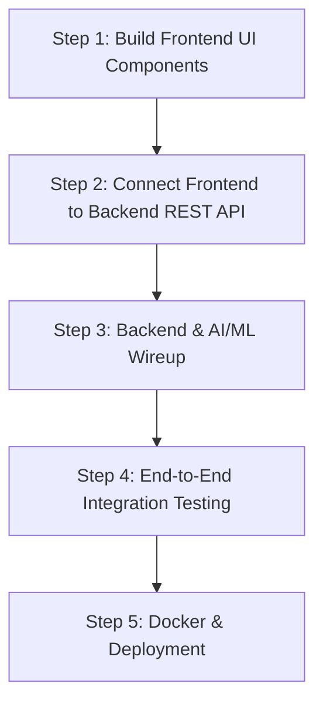

# Mhmm.ai — Industrial Knowledge Intelligence Platform
## Comprehensive Project Status, Gap Analysis & Completion Roadmap

**Date:** July 19, 2026  
**Repository:** `https://github.com/arjunmk44/Mhmm.ai.git`

---

## 📊 Executive Summary & Overall Progress

| Pillar | Progress | Status | Primary Owner / Tech Stack |
| :--- | :---: | :---: | :--- |
| **AI / ML Intelligence Engine** | **100%** | ✅ Completed & Tested | Gemini 2.5 Flash, Groq Llama 3.3, LangGraph, SentenceTransformers, Neo4j, pgvector |
| **Backend Service & Data Layer** | **80%** | 🟡 Near Integration | FastAPI, SQLAlchemy, PostgreSQL, APScheduler, Alembic |
| **Frontend Web Application** | **15%** | 🟠 Skeleton / Stubs | React, Vite, Tailwind CSS, React Query, react-force-graph |
| **Infra & DevOps** | **70%** | 🟡 Ready for Local Stack | Docker Compose, PostgreSQL (pgvector container), Neo4j AuraDB |

---

## 1. ✅ What Has Been Done (Completed Work)

### A. AI/ML Module (`/ai_ml`) — **100% COMPLETE**
All core pipelines, model routers, vector stores, graph builders, agents, interfaces, and unit tests are fully built and validated:

1. **Configuration & Settings (`ai_ml/config/`)**
   - [`constants.py`](file:///C:/Users/achyu/OneDrive/Desktop/PROJECTS/Economic%20Times/ai_ml/config/constants.py): Defined document types, node labels (`Equipment`, `Document`, `Person`, `Incident`, `RegulatoryRef`, `ProcessParameter`), relationship types (`MENTIONED_IN`, `MAINTAINED_BY`, `LINKED_TO_INCIDENT`, `REFERENCES_REGULATION`, `PART_OF`, `CONNECTED_TO`), embedding dimension (384), and JSON schema definitions.
   - [`settings.py`](file:///C:/Users/achyu/OneDrive/Desktop/PROJECTS/Economic%20Times/ai_ml/config/settings.py): Pydantic settings loading environment variables (`GEMINI_API_KEY`, `GROQ_API_KEY`, `NEO4J_URI`, `DATABASE_URL`) with fallback options.

2. **Multimodal LLM Routing & Fallback (`ai_ml/llm/` & `ai_ml/prompts/`)**
   - [`gemini_client.py`](file:///C:/Users/achyu/OneDrive/Desktop/PROJECTS/Economic%20Times/ai_ml/llm/gemini_client.py): Native multimodal text + image processing using **Gemini 2.5 Flash** (`google-genai`).
   - [`groq_client.py`](file:///C:/Users/achyu/OneDrive/Desktop/PROJECTS/Economic%20Times/ai_ml/llm/groq_client.py): Secondary backup provider using Groq Llama 3.3 70B.
   - [`model_router.py`](file:///C:/Users/achyu/OneDrive/Desktop/PROJECTS/Economic%20Times/ai_ml/llm/model_router.py): Intelligent fallback router (Gemini ➔ Groq ➔ Rule-based heuristic fallback) ensuring zero-crash behavior even without API keys.
   - [`extraction_prompt.py`](file:///C:/Users/achyu/OneDrive/Desktop/PROJECTS/Economic%20Times/ai_ml/prompts/extraction_prompt.py), [`query_prompt.py`](file:///C:/Users/achyu/OneDrive/Desktop/PROJECTS/Economic%20Times/ai_ml/prompts/query_prompt.py), [`failure_analysis_prompt.py`](file:///C:/Users/achyu/OneDrive/Desktop/PROJECTS/Economic%20Times/ai_ml/prompts/failure_analysis_prompt.py): Standardized prompt templates enforcing structured JSON output and inline source citations.

3. **Multimodal Ingestion & Chunking (`ai_ml/ingestion/` & `ai_ml/extraction/`)**
   - [`loader.py`](file:///C:/Users/achyu/OneDrive/Desktop/PROJECTS/Economic%20Times/ai_ml/ingestion/loader.py): Universal document loader for PDFs (`pypdf`, `pdfplumber`), Excel/CSV (`pandas`), scanned forms/P&ID drawings (`PIL`), and text/EML files.
   - [`parser.py`](file:///C:/Users/achyu/OneDrive/Desktop/PROJECTS/Economic%20Times/ai_ml/ingestion/parser.py): Metadata and preliminary equipment tag extraction engine.
   - [`chunking.py`](file:///C:/Users/achyu/OneDrive/Desktop/PROJECTS/Economic%20Times/ai_ml/ingestion/chunking.py): Overlapping text chunker preserving industrial equipment tags.
   - [`gemini_extractor.py`](file:///C:/Users/achyu/OneDrive/Desktop/PROJECTS/Economic%20Times/ai_ml/extraction/gemini_extractor.py), [`entity_extractor.py`](file:///C:/Users/achyu/OneDrive/Desktop/PROJECTS/Economic%20Times/ai_ml/extraction/entity_extractor.py), [`relationship_extractor.py`](file:///C:/Users/achyu/OneDrive/Desktop/PROJECTS/Economic%20Times/ai_ml/extraction/relationship_extractor.py): Normalization for tags, personnel, dates, process parameters, and directional edges.

4. **Embeddings & Vector Storage (`ai_ml/embeddings/`)**
   - [`embedding_model.py`](file:///C:/Users/achyu/OneDrive/Desktop/PROJECTS/Economic%20Times/ai_ml/embeddings/embedding_model.py): 384-dimensional dense vector embeddings via `sentence-transformers/all-MiniLM-L6-v2`.
   - [`vector_store.py`](file:///C:/Users/achyu/OneDrive/Desktop/PROJECTS/Economic%20Times/ai_ml/embeddings/vector_store.py): PostgreSQL `pgvector` store with cosine similarity vector search and in-memory fallback index.

5. **Knowledge Graph & Deduplication (`ai_ml/graph/`)**
   - [`entity_resolution.py`](file:///C:/Users/achyu/OneDrive/Desktop/PROJECTS/Economic%20Times/ai_ml/graph/entity_resolution.py): Sequence matching & tag normalization preventing duplicate graph nodes.
   - [`neo4j_client.py`](file:///C:/Users/achyu/OneDrive/Desktop/PROJECTS/Economic%20Times/ai_ml/graph/neo4j_client.py), [`cypher_queries.py`](file:///C:/Users/achyu/OneDrive/Desktop/PROJECTS/Economic%20Times/ai_ml/graph/cypher_queries.py), [`graph_builder.py`](file:///C:/Users/achyu/OneDrive/Desktop/PROJECTS/Economic%20Times/ai_ml/graph/graph_builder.py): Neo4j AuraDB Cypher `MERGE` query builder with NetworkX memory fallback.

6. **Hybrid RAG Retrieval (`ai_ml/retrieval/`)**
   - [`vector_search.py`](file:///C:/Users/achyu/OneDrive/Desktop/PROJECTS/Economic%20Times/ai_ml/retrieval/vector_search.py), [`graph_search.py`](file:///C:/Users/achyu/OneDrive/Desktop/PROJECTS/Economic%20Times/ai_ml/retrieval/graph_search.py), [`keyword_search.py`](file:///C:/Users/achyu/OneDrive/Desktop/PROJECTS/Economic%20Times/ai_ml/retrieval/keyword_search.py).
   - [`hybrid_retriever.py`](file:///C:/Users/achyu/OneDrive/Desktop/PROJECTS/Economic%20Times/ai_ml/retrieval/hybrid_retriever.py): Merges vector similarity, graph neighborhood, and exact tag keyword matches into a single re-ranked context for LLM answer synthesis with inline source citations.

7. **Agent Workflows (`ai_ml/agents/`)**
   - [`ingestion_agent.py`](file:///C:/Users/achyu/OneDrive/Desktop/PROJECTS/Economic%20Times/ai_ml/agents/ingestion_agent.py): **LangGraph** state machine (`load_document` ➔ `extract_knowledge` ➔ `write_graph` ➔ `embed_and_index`).
   - [`failure_intelligence_agent.py`](file:///C:/Users/achyu/OneDrive/Desktop/PROJECTS/Economic%20Times/ai_ml/agents/failure_intelligence_agent.py): **LangGraph** state machine (`fetch_context` ➔ `analyze_patterns`).

8. **Backend Integration Interfaces (`ai_ml/interfaces/`)**
   - Section 4 Integration Contract functions: `ingest_document()`, `query_knowledge()`, `get_graph_neighborhood()`, `run_failure_scan()`.
   - **Automated Tests**: Tested via `pytest ai_ml/tests` (**7/7 passed**).

---

### B. Backend Module (`/backend`) — **80% COMPLETE**
- **Database Models & Schemas**: `Document`, `DocumentChunk`, `Alert`, `AuditLog` defined in SQLAlchemy.
- **REST API Endpoints**:
  - `POST /api/documents/upload`
  - `GET /api/documents` & `GET /api/documents/{id}`
  - `POST /api/query`
  - `GET /api/graph/neighborhood`
  - `GET /api/alerts` & `POST /api/alerts/{id}/acknowledge`
- **Services & Schedulers**: [`ingestion_service.py`](file:///C:/Users/achyu/OneDrive/Desktop/PROJECTS/Economic%20Times/backend/app/services/ingestion_service.py), [`query_service.py`](file:///C:/Users/achyu/OneDrive/Desktop/PROJECTS/Economic%20Times/backend/app/services/query_service.py), [`alert_service.py`](file:///C:/Users/achyu/OneDrive/Desktop/PROJECTS/Economic%20Times/backend/app/services/alert_service.py), [`scheduler.py`](file:///C:/Users/achyu/OneDrive/Desktop/PROJECTS/Economic%20Times/backend/app/services/scheduler.py) (APScheduler cron job for failure scans).

---

## 2. 📋 What Has To Be Done (Remaining Tasks)

### A. Frontend Application (`/frontend`) — **High Priority**
The frontend pages currently exist as minimal placeholders. The following components and pages need implementation:
1. **App Shell & Routing (`frontend/src/App.tsx`)**: Navigation bar, sidebar, and layout header.
2. **Dashboard Page (`frontend/src/pages/Dashboard.tsx`)**: Metrics summary, active alerts feed, recent uploads.
3. **Document Upload Page (`frontend/src/pages/Upload.tsx`)**: Drag-and-drop file uploader connected to `POST /api/documents/upload`.
4. **Document List Page (`frontend/src/pages/Documents.tsx`)**: Interactive table showing upload status (`processing`, `ingested`, `failed`) polling `GET /api/documents`.
5. **Knowledge Query Page (`frontend/src/pages/Query.tsx`)**: Search box, query filters, synthesized answer renderer, inline source citation viewer.
6. **Knowledge Graph Explorer Page (`frontend/src/pages/Graph.tsx`)**: Interactive graph visualization powered by `react-force-graph` fetching `GET /api/graph/neighborhood`.
7. **Failure Intelligence Alerts Page (`frontend/src/pages/Alerts.tsx`)**: Risk severity badges, alert cards, acknowledge button connected to `POST /api/alerts/{id}/acknowledge`.

### B. Backend Integration Polish
1. **Enable Live AI/ML Mode**: Change `MOCK_AI_ML` default to `False` in backend config.
2. **Database Migration Initialization**: Run Alembic migration scripts or ensure tables auto-create on container startup.
3. **End-to-End Smoke Tests**: Verify FastAPI routes seamlessly trigger `ai_ml.interfaces` without schema mismatches.

### C. Deployment & DevOps
1. **Local Docker Validation**: Run `docker compose up --build` and verify Postgres (pgvector), FastAPI backend, and React frontend communicate locally.
2. **Environment Variable Configuration**: Ensure `.env` is populated with valid `GEMINI_API_KEY`, `GROQ_API_KEY`, `NEO4J_URI`, and `DATABASE_URL`.
3. **Production Deployment**: Push backend to Railway/Render and frontend to Vercel/Netlify.

---

## 🚀 Step-by-Step Execution Plan to 100% Completion

### Phase 1: Frontend UI Implementation (Estimated: 2–3 Hours)
- Implement `App.tsx` and `AppShell` with dark-themed responsive layout.
- Build `UploadDropzone`, `QueryBox`, `AnswerCard` with source citations.
- Implement `GraphExplorer` using `react-force-graph-2d` for interactive node expansion.
- Implement `AlertsFeed` and `DocumentStatusList` with React Query polling.

### Phase 2: Live System Wiring & Testing (Estimated: 1 Hour)
- Point `VITE_API_BASE_URL` to backend service (`http://localhost:8000`).
- Test complete end-to-end user flow:
  1. Upload PDF / image / maintenance record.
  2. Watch live status update to `ingested`.
  3. Query the knowledge base and receive synthesized answers with citations.
  4. Explore the Neo4j graph neighborhood visually.
  5. Trigger failure intelligence scan and view generated risk alerts.

### Phase 3: Deployment (Estimated: 30 Mins)
- Verify `docker-compose.yml` local build.
- Deploy frontend to Vercel and backend to Railway/Render.
